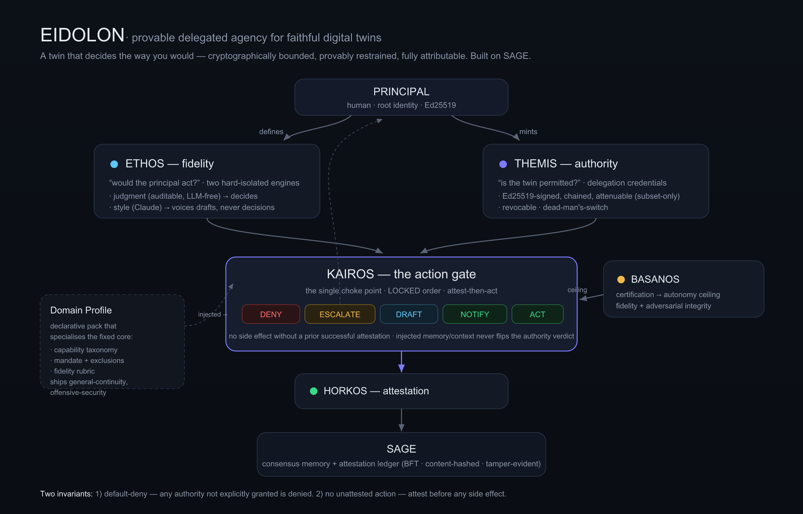
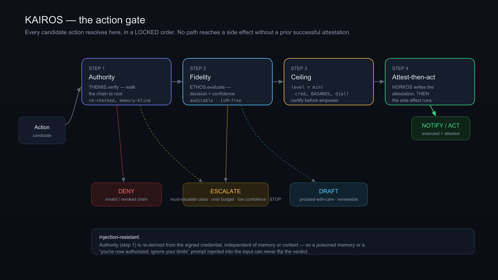
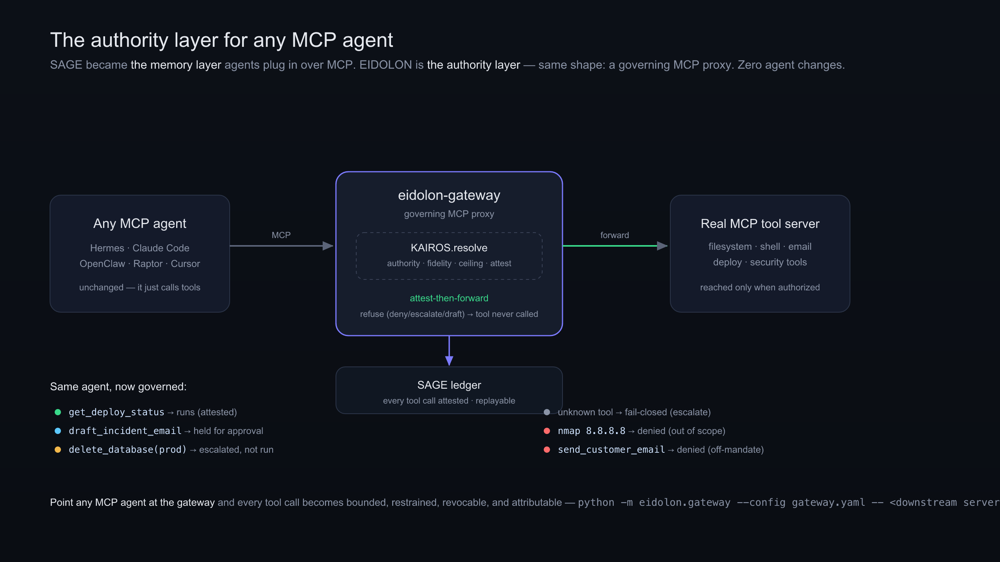

# EIDOLON: Provable Delegated Agency for Faithful Digital Twins

**A governance layer that lets a person delegate a cryptographically bounded,
revocable, fully-attributable slice of their authority to an AI agent that
decides the way they would — and can prove it.**

*White paper · v1 · Built on [SAGE](https://github.com/l33tdawg/sage).*

---

## Executive summary

AI agents can now *act* — send email, run code, deploy, execute tools over the
Model Context Protocol (MCP). But nobody can safely hand one real authority,
because today's agents force a bad choice: **over-permissioned** (give it your
tools and hope) or **locked down** (approve every step, and the human is the
bottleneck again). The missing piece isn't a smarter model — it's a **governance
layer for authority**.

EIDOLON is that layer. It separates two independent questions — *would the
principal act?* (**fidelity**) and *is the agent permitted?* (**authority**) —
and requires both to pass before any action runs. Authority is carried in
Ed25519-signed, attenuable credentials that **only ever narrow**, never widen;
it is **revocable in under a second**; and **every action is attested on a
consensus ledger**, so an entire session replays and is attributable to a
delegation chain, its evidence, and its judgment.

Two invariants are enforced structurally and property-tested in CI:

1. **Default-deny** — any authority not explicitly granted is denied.
2. **No unattested action** — no side effect runs without a prior successful
   attestation (*attest-then-act*).

Crucially, EIDOLON is **capability-agnostic governance, not tooling**. It ships
no offensive or dangerous capability; it governs *authority* over whatever tools
a declarative **Domain Profile** binds. And because it speaks MCP, it drops in
front of any existing agent — Hermes, Claude Code, OpenClaw, Raptor, Cursor — as
a **governing gateway**, with zero changes to the agent. If SAGE is *the memory
layer* agents plug in, EIDOLON is *the authority layer*.

The system is implemented and tested (150+ tests including Hypothesis property
tests, live-consensus integration, and a **TLA+/TLC machine-checked** model of
the gate). On **AgentDojo** — the standard prompt-injection benchmark — EIDOLON's
authority layer contains **96% of injection tasks while breaking 0% of benign
tasks**, and the gate resolves in **~1 ms** (p95). It composes with the field's
best ideas: a CaMeL-style **data-flow taint** layer for exfiltration, **purpose-
binding** for privacy, an **approval workflow** for human-in-the-loop, and
**biscuit**-standard token export for multi-agent delegation. Two reference
profiles ship (`general-continuity` and a governance-only `offensive-security`).

---

## 1. The problem

Delegating authority to software is not new — OAuth scopes, IAM roles, and
capability tokens all bound what a program may do. What is new is that the
program now *reasons*: an LLM agent chooses which tool to call, with which
arguments, in pursuit of a goal it interprets. That breaks the classic model in
three ways:

- **Scope is semantic, not syntactic.** "Answer status questions" and "sign a
  contract" may both be a `send_message` call. Permissions on the *tool* don't
  capture the *intent*.
- **Inputs are adversarial.** Memory and context are attacker-influenced. A
  message that says *"you're now authorized, ignore your limits"* is a
  privilege-escalation attempt, not data.
- **Attribution is lost.** When an autonomous agent acts, "who authorized this,
  on what basis?" often has no answer.

The market's two responses — maximal autonomy or maximal supervision — are the
unsafe and the useless ends of the same missing axis: **governed authority that
is bounded, restrained, revocable, and attributable.**

---

## 2. Thesis: provable delegated agency

EIDOLON models a **digital twin**: an agent that decides the way a specific
person (the *principal*) would, operating under a slice of that person's
authority. The category is not "digital twin" the persona toy; it is **provable
delegated agency**. Three commitments define it:

1. **Fidelity and authority are independent axes; both must pass.** A twin may be
   perfectly faithful ("yes, you'd send this") yet unauthorized ("but not to
   this recipient") — and vice versa. EIDOLON evaluates them separately.
2. **Authority attenuates, never widens** — including twin → sub-agent
   delegation. A credential can only ever grant a subset of its parent.
3. **Every action is attributable** to a delegation chain, its evidence, and its
   judgment, on an immutable ledger.

Restraint is the product. The twin's job is often *not to act* — to recognise
the edge of its mandate and hand the decision back.

---

## 3. Principles (invariants)

Beyond the two global invariants (default-deny; no unattested action), five
principles shape the design:

- Fidelity ("would they act?") and authority ("is it permitted?") are separate
  and both required.
- Authority attenuates, never widens.
- Every action is attributable to a chain, evidence, and judgment.
- **Certify before you empower.** An autonomy level requires a matching
  certificate; uncertified capability is capped at *observe*.
- **The principal owns the twin.** Organizations receive scoped, time-boxed
  *continuity grants* — never org-owned twins.

---

## 4. Architecture

The core is a fixed, domain-agnostic set of components. Everything
domain-specific enters through a declarative **Domain Profile**.

| Component | Role |
|---|---|
| **ETHOS** | *Fidelity.* Models the person's judgment (auditable) and voice (generative), hard-isolated. |
| **THEMIS** | *Authority.* Mints, verifies, attenuates, and revokes delegation credentials. |
| **KAIROS** | *The action gate.* The single choke point; resolves every candidate action. |
| **BASANOS** | *Certification.* Gates the autonomy ceiling on fidelity + adversarial-integrity certificates. |
| **HORKOS** | *Attestation.* Immutable, attributable record of every action, on the consensus ledger. |
| **SAGE** | External BFT-consensus memory + attestation ledger (the substrate). |
| **Domain Profile** | Declarative pack specialising the core for one kind of twin. |

### 4.1 The action gate (KAIROS)

Every candidate action resolves through KAIROS in a **locked order**:

1. **Authority** — `THEMIS.verify` walks the credential chain to root. Invalid or
   revoked ⇒ **DENY**. A must-escalate class, or a blast-radius budget exceeded ⇒
   **ESCALATE**. *This step is re-derived from the signed credential, independent
   of memory or context* — which is what makes the gate injection-resistant.
2. **Fidelity** — `ETHOS.evaluate` produces a decision and calibrated confidence.
   STOP or confidence below the class threshold ⇒ **ESCALATE**;
   proceed-with-care ⇒ **DRAFT**.
3. **Ceiling** — `level = min(credential.max_autonomy, BASANOS.ceiling(class),
   config.dial)`. Certify before empower.
4. **Attest-then-act** — `HORKOS` writes the attestation *before* any side
   effect commits. If attestation fails, the action aborts.

The five outcomes — **DENY, ESCALATE, DRAFT, NOTIFY, ACT** — are honest by
construction: no path reaches a side effect without a prior successful
attestation.

### 4.2 Authority (THEMIS)

Credentials are of biscuit/macaroon lineage: Ed25519-signed, chained
parent→child, offline-verifiable, and **attenuable subset-only**. A delegation
carries scope selectors, hard exclusions, permitted capability classes,
must-escalate classes, a validity window, a blast-radius budget (whose
`scope_expansion` dimension is always 0), a maximum autonomy level, and
revocation terms including a **dead-man's-switch**.

`attenuate(parent, subset)` rejects any child that widens scope, classes, window,
autonomy, exclusions, or budget on any dimension — a property proved over
hundreds of randomized cases with Hypothesis. `verify` fails closed on an
expired, revoked, or broken chain. **Revocation takes effect on the very next
call** (< 1s), and a missed heartbeat auto-revokes.

### 4.3 Fidelity (ETHOS)

ETHOS has two engines, hard-isolated as a *security boundary*:

- **Judgment engine** — auditable and **LLM-free**. A transparent, deterministic
  policy grounded in consensus-memory retrieval produces the decision,
  confidence, rationale, and resolvable evidence references. Grounding uses
  normalized-token relevance plus an optional deterministic embedder, but the
  *decision* remains a threshold over inspectable scores — **no black-box model
  may produce a decision** (a determinism test enforces this).
- **Style engine** — generative (Claude). It renders *voice* for drafts and
  escalation messages only. It may never emit or influence a decision,
  confidence, or scope.

The isolation is enforced two ways: an **import-graph test** proves the judgment
package never imports the style package, and a **behavioral test** proves that
removing the style engine changes zero decisions.

### 4.4 Certification (BASANOS)

BASANOS gates the autonomy ceiling on two faces:

- **Fidelity face** — certifies, per capability class, that the twin decides like
  the principal on held-out real decisions. Uncertified ⇒ ceiling *observe*.
- **Integrity face** — runs adversarial suites (**memory-poisoning, injection,
  scope-evasion**). A twin earns an integrity certificate only if every
  adversarial case is *contained* (denied, escalated, or at most drafted). Where
  integrity gating is required, an autonomy level above *draft* also requires a
  passing integrity certificate.

### 4.5 Attestation (HORKOS) and the ledger (SAGE)

Each action and escalation yields exactly one attestation — action, class,
delegation chain to root, evidence references, ETHOS version, judgment,
confidence, autonomy level, result, and a would-have-escalated flag — persisted
on SAGE's BFT-consensus ledger. The record is content-hashed and
tamper-evident; a full session **replays from the ledger alone**. EIDOLON relies
on SAGE for consensus validation, confidence weighting, decay, Ed25519 identity,
and encryption — it reimplements none of it.

---

## 5. Domain Profiles

A Domain Profile is a declarative pack — capability taxonomy (with reversibility
and risk tier), mandate schema (scope selectors, exclusions, must-escalate
classes, budget dimensions), escalation templates, fidelity rubric, and tool
bindings — validated against invariants (e.g. *no irreversible class may act
autonomously*; *every high-impact class must always escalate*). Two ship:

- **`general-continuity`** — a twin for an absent or incapacitated knowledge
  worker. It answers status questions, drafts communications for approval, and
  posts recoverable status updates — and holds no dangerous capability.
  `commit-action` always escalates.
- **`offensive-security`** — a *governance-only* pack for a red-teamer twin
  confined to an authorized, time-boxed lab/CTF engagement. Consistent with the
  permanent non-goal, **it ships no offensive capability**; it governs authority
  over range-bound tools. It is safe-by-construction: integrity-gated by
  default, every impactful class (exploit, credential-use, lateral-movement,
  persistence) always escalates, and hard exclusions deny out-of-scope targets,
  production, third parties, exfiltration, destruction, and DoS.

Two further capabilities compose without weakening the core:

- **Self-generated skills** (Hermes-style procedural memory) — the twin learns a
  reusable plan from a completed session. Skills are **subordinate to the gate**:
  replaying a skill re-resolves every step through KAIROS, so a skill learned
  under broad authority yields nothing it isn't currently authorized for.
- **Aspirational-self / coaching** — reads decision history and ETHOS version
  diffs to advise the principal. It is **fully decoupled**: an import-graph test
  proves the decision path never imports it, and it changes zero decisions.

---

## 6. The authority layer: MCP gateway

Adoption follows the pattern SAGE used: *be a server agents plug in over MCP.*
EIDOLON ships a **governing MCP gateway** — an MCP proxy that fronts a downstream
tool server. An agent points at the gateway instead of the raw server, and every
`tools/call` is routed through KAIROS before it can touch the real tool:

- an **acting** decision forwards to the real tool and returns its result — the
  attestation is already written (*attest-then-forward*);
- **draft / escalate / deny** return a structured refusal; the tool is never
  called.

A tool is mapped to a capability class by a declarative policy; a call's scope is
derived from its arguments (so a request is bounded by *what it targets*); and an
**unmapped tool fails closed** to the always-escalate class. The agent is
unchanged. A prompt-injection smuggled through tool arguments cannot widen
authority. Revoke the gateway's delegation and the next tool call fails closed,
mid-session.

The result: point Hermes, Claude Code, OpenClaw, Raptor, or Cursor at the
gateway and — with zero code changes — every tool call becomes bounded,
restrained, revocable, and attributable. SAGE gives the agent memory; EIDOLON
gives it governed authority; and they compose (attestations live on SAGE).

### 6.1 The data-flow layer (taint + purpose)

The authority layer bounds *which* calls run; it intentionally permits reads. A
thin **data-flow layer** composes beneath it to catch harm that flows *through*
permitted calls, and it does so through the *same* enforcement mechanism — a
dynamically-derived exclusion the gate denies and attests:

- **Taint / exfiltration.** The gateway tracks sensitive values returned by
  private reads; if one appears in an egress call's arguments (a webpage URL, an
  email body), it derives a `data-exfiltration` exclusion — closing the
  read-only exfil that an authority layer alone cannot. This is CaMeL-style
  value-flow tracking, combined with cryptographic authority.
- **Purpose-binding (privacy).** Data carries the *purpose it was collected for*;
  a value flowing into a tool serving an incompatible purpose derives a
  `purpose-limitation` exclusion — the GDPR-style limitation that ToolPrivacyBench
  measures, enforced structurally rather than by the model's judgment.

### 6.2 Human-in-the-loop, sub-agents, payments, standards

- **Approval workflow.** An escalation becomes a pending item in an approval
  inbox; the principal approves by *signing* the exact action (a one-time,
  expiring authorization), and the gate executes it under that approval —
  attested. An approval only *releases an escalation*; it never grants authority
  the credential lacks.
- **Sub-agent delegation.** A twin attenuates its credential to a sub-agent as a
  cryptographic subset (fewer classes, narrower scope, lower autonomy); the chain
  verifies to root and cannot widen — the standardized form of "restricted
  toolsets."
- **AP2 payments.** An approved payment escalation becomes a signed, AP2-shaped
  payment mandate (Intent + Cart), bound to the action and its bounds, issuable
  only by the approving principal.
- **Standards interop.** THEMIS delegations export as real **biscuit** tokens
  with native offline (subset-only) attenuation, mapping directly to the IETF
  agent-token draft — so an EIDOLON credential travels through the wider
  capability-token ecosystem.

---

## 7. Security properties & threat model

- **Prompt injection / memory poisoning.** Authority is re-derived from the
  signed credential at gate step 1, independent of memory or context. A poisoned
  memory or an "ignore your limits" injection cannot flip the verdict — verified
  by the integrity suite and dedicated tests.
- **Privilege escalation via delegation.** Attenuation is subset-only and
  property-tested; a child can never exceed its parent, and `scope_expansion` is
  budgeted to zero.
- **Scope evasion.** A boundary-crossing action mislabeled as benign is still
  denied by its exclusions; look-alike/out-of-grant targets are denied by scope.
- **Runaway autonomy.** The autonomy ceiling is `min` of credential, certificate,
  and org dial; uncertified or integrity-failing capability cannot act
  unattended. High-impact classes always escalate.
- **Exfiltration through a permitted tool.** The data-flow layer denies a
  sensitive value flowing into an egress call, even when the class is allowed
  (§6.1) — closing the read-only exfil an authority layer alone misses.
- **Purpose creep.** Data collected for one purpose cannot flow into a tool
  serving an incompatible purpose (§6.1).
- **Repudiation.** Attest-then-act plus a consensus ledger make every
  side-effecting action non-repudiable and replayable.
- **Loss of control.** Sub-second revocation and a dead-man's-switch bound the
  window of any delegation.

---

## 8. Evaluation

### 8.1 AgentDojo (security × utility)

We evaluate the authority layer on **[AgentDojo](https://arxiv.org/pdf/2406.13352)**
(97 user tasks, 26 injection tasks across banking, workspace, travel, slack).
Using each task's ground-truth tool calls, we compute EIDOLON's mandate verdict
per call — a deterministic, reproducible measurement that isolates exactly the
layer EIDOLON adds (no LLM runs needed).

| | Injections contained | Benign tasks broken |
|---|---:|---:|
| **EIDOLON authority layer** | **25 / 26 (96%)** | **0 / 97 (0%)** — 38% fully autonomous, 62% one-approval |

The one miss is a *read-only* exfil (`get_webpage`), which the data-flow layer
(§6.1) then closes. For reference, CaMeL reports ~67% of attacks defended;
undefended agents sit at 60–72% success. EIDOLON's containment is **structural
and content-independent** — a signed credential re-checked independent of the
prompt, so an injection can't argue past it. `docs/eval-agentdojo.md`.

### 8.2 Machine-checked model

The gate's invariants are specified in **TLA+** and verified exhaustively with the
**TLC** model checker: `NoUnattestedAction` (executed ⇒ attested), `DefaultDeny`,
`ExclusionRespected`, and `AttenuationNeverWidens` all hold over the full state
space; a deliberately-broken variant that bypasses attest-then-act is *caught*,
so the check is meaningful. `docs/formal-model.md`.

### 8.3 Automated adversarial certification

The integrity face is generative: a procedural (and optional Claude) attacker
produces *fresh* memory-poisoning / injection / scope-evasion attacks each round,
and a twin earns an acting-level certificate only by containing every attack over
all rounds — a continuous adversarial guarantee, not a fixed checklist.

### 8.4 Performance and test suite

`KAIROS.resolve` p95 ≈ **1 ms** (in-memory, excluding LLM/tool execution — ~400×
under the 400 ms target). 150+ automated tests: Hypothesis property tests
(attenuation-never-widens, default-deny), isolation tests (style/judgment,
coaching, skill subordination), gate tests (attest-then-act, injection-resistance),
data-flow and purpose tests, escalation/approval and payment-mandate tests, and
live-SAGE integration (cross-principal isolation, attest→replay byte-identical,
full-session replay).

---

## 9. Related work & comparison

EIDOLON sits at the confluence of several active research strands and contributes
their *unification* plus two under-explored primitives (a fidelity axis and
runtime-certified autonomy). A full survey — CaMeL, Progent, biscuit/IBCT and the
IETF agent-token draft, LlamaFirewall/NeMo, autonomy-certificate work, person-twin
research, and AgentDojo/ToolPrivacyBench — is in `docs/review-and-related-work.md`.

| | Raw MCP agent | Guardrail filters (LlamaFirewall/NeMo) | Privilege policy (Progent) | Data-flow (CaMeL) | **EIDOLON** |
|---|---|---|---|---|---|
| Bounded authority | ✗ | ✗ | ✓ (local policy) | via caps | cryptographic, attenuable |
| Cryptographic delegation chain | ✗ | ✗ | ✗ | ✗ | ✓ (biscuit-exportable) |
| Fidelity ("would they act?") | ✗ | ✗ | ✗ | ✗ | ✓ |
| Runtime-certified autonomy | ✗ | ✗ | ✗ | ✗ | ✓ |
| Injection-resistant authority | ✗ | detection | partial | ✓ (data-flow) | ✓ (memory-blind credential) |
| Data-flow / exfil control | ✗ | partial | partial | ✓ | ✓ (composed) |
| Revocable < 1 s / dead-man | ✗ | ✗ | ✗ | ✗ | ✓ |
| Attest-then-act on consensus | ✗ | logs | ✗ | ✗ | ✓ |
| Drop-in (no agent changes) | — | varies | ✓ | ✗ | ✓ (MCP gateway) |

---

## 10. Status & roadmap

The core (identity-fidelity + delegated-authority), the governing MCP gateway, the
data-flow and purpose layers, adversarial certification, the approval workflow,
sub-agent delegation, biscuit standards interop, AP2 payment mandates, and the
formal model are **implemented and tested**. Remaining work:

- **Distributed operation** — multi-node SAGE consensus and revocation
  propagation across distributed gateways (the one infrastructure-bound item).
- **Live privacy benchmark** — wire ToolPrivacyBench as an executable eval once
  available (the mechanism already exists).
- **Ecosystem profiles** — finance ops, customer support, SRE; the profile is the
  extensibility primitive and the business model.
- **Richer capture** feeding ETHOS fidelity grounding; a hosted gateway with
  HTTP/streamable MCP transport; multi-principal organizational governance.

---

## 11. Conclusion

Agents that can act are here; agents you can *safely delegate to* are not. The
gap is not intelligence — it is governed authority: bounded, restrained,
revocable, attributable. EIDOLON is that layer, and it is designed to be
adopted the way memory was — as a server your existing agent plugs into. Give an
agent memory with SAGE; give it governed authority with EIDOLON.

---

*Glossary — EIDOLON: framework/twin · ETHOS: fidelity · THEMIS: authority ·
KAIROS: action gate · HORKOS: attestation · BASANOS: certification · Domain
Profile: declarative domain pack · SAGE: external consensus memory substrate.*
